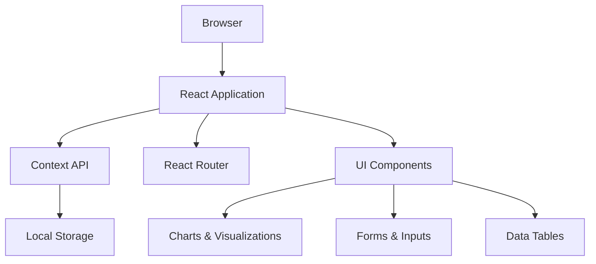
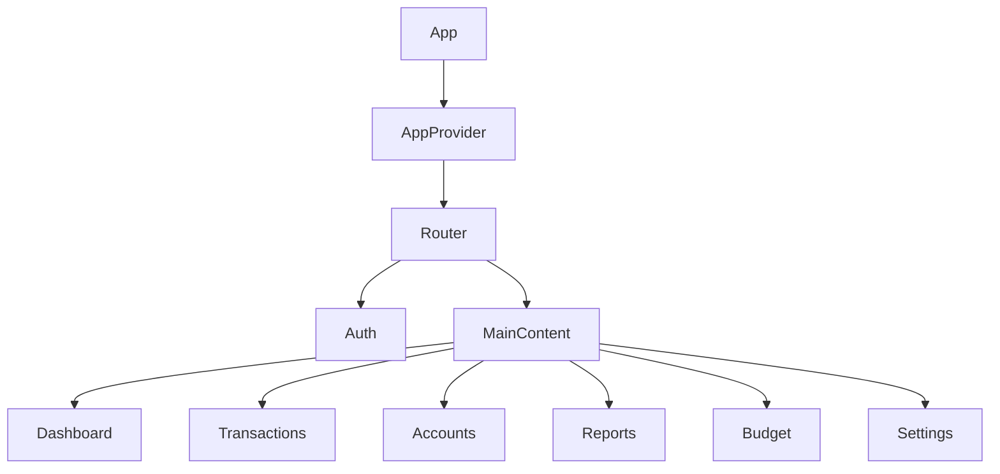
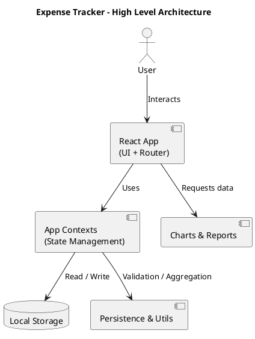
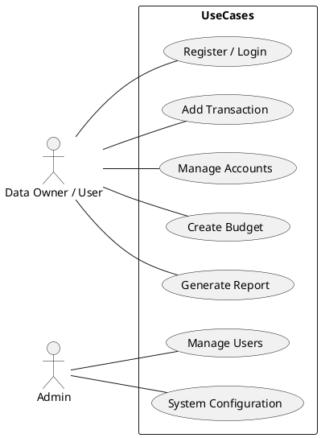

# 4. System Design

## 4.1 Architecture Overview

### 4.1.1 High-Level Architecture

The Personal Finance Management System follows a modern single-page application (SPA) architecture with the following key components:



1. **Frontend Layer**
   - React.js components
   - React Router for navigation
   - React Bootstrap for UI
   - Chart.js for visualizations

2. **State Management**
   - React Context API
   - Local Storage persistence
   - Component-level state
   - Memoized computations

3. **Data Layer**
   - Browser Local Storage
   - In-memory state
   - JSON data structure
   - CRUD operations

### 4.1.2 Technical Stack

```json
{
  "frontend": {
    "framework": "React 18.3.1",
    "routing": "React Router 7.9.5",
    "ui": "React Bootstrap 2.10.6",
    "charts": "Chart.js 4.5.1",
    "datePicker": "React DatePicker 7.5.0",
    "select": "React Select 5.8.3",
    "exports": "XLSX 0.18.5"
  }
}
```

## 4.2 Component Design

### 4.2.1 Component Hierarchy



### 4.2.2 Core Components

1. **App Provider (`AppContext.js`)**
   ```javascript
   const AppProvider = ({ children }) => {
     const [users, setUsers] = useState([]);
     const [currentUserId, setCurrentUserId] = useState(null);
     
     // Authentication methods
     const register = async ({ name, email, password }) => {...}
     const login = async (email, password) => {...}
     const logout = () => {...}
     
     // Data management
     const addAccount = (account) => {...}
     const addTransaction = (transaction) => {...}
     
     return (
       <AppContext.Provider value={contextValue}>
         {children}
       </AppContext.Provider>
     );
   };
   ```

2. **Authentication (`Auth.jsx`)**
   - Login/Register forms
   - Session management
   - Protected routes
   - Authentication state

3. **Dashboard (`Dashboard.jsx`)**
   - Summary cards
   - Recent transactions
   - Quick actions
   - Charts and graphs

4. **Transaction Management**
   - Transaction list
   - Filtering system
   - CRUD operations
   - Category management

### 4.2.3 Feature Components

1. **Account Management**
   ```javascript
   // Account operations
   const addAccount = (account) => {
     const acct = { 
       ...account, 
       id: `a_${Date.now()}` 
     };
     setUsers(prev => prev.map(u =>
       u.id === currentUserId
         ? { ...u, accounts: [...(u.accounts || []), acct] }
         : u
     ));
     return acct;
   };
   ```

2. **Transaction Forms**
   - Income entry
   - Expense entry
   - Transfer handling
   - Validation logic

3. **Reports and Analytics**
   - Data aggregation
   - Chart generation
   - Filter application
   - Export functionality

## 4.3 Database Design

### 4.3.1 Data Model

1. **User Schema**
   ```javascript
   {
     id: string,
     name: string,
     email: string,
     password: string,
     accounts: Account[],
     transactions: Transaction[]
   }
   ```

2. **Account Schema**
   ```javascript
   {
     id: string,
     name: string,
     type: string,
     balance: number,
     group: string,
     userId: string
   }
   ```

3. **Transaction Schema**
   ```javascript
   {
     id: string,
     date: Date,
     type: string,
     amount: number,
     from: string,
     to: string,
     tag: string,
     note: string,
     userId: string
   }
   ```

### 4.3.2 Data Storage

1. **Local Storage Structure**
   ```javascript
   {
     "expense_users": User[],
     "expense_currentUserId": string
   }
   ```

2. **State Management**
   - Context-based state
   - Local storage sync
   - Memory optimization
   - Data persistence

## 4.4 User Interface Design

### 4.4.1 Layout Design

1. **Main Layout**
   - Header navigation
   - Sidebar menu
   - Content area
   - Responsive design

2. **Component Layout**
   - Card-based design
   - Grid system
   - Flex containers
   - Modal dialogs

### 4.4.2 UI Components

1. **Navigation**
   - Breadcrumb trail
   - Menu structure
   - Quick actions
   - User menu

2. **Forms**
   - Input validation
   - Error handling
   - Auto-completion
   - Dynamic updates

3. **Data Display**
   - Tables
   - Charts
   - Cards
   - Lists

### 4.4.3 Responsive Design

1. **Breakpoints**
   ```css
   {
     "sm": "576px",
     "md": "768px",
     "lg": "992px",
     "xl": "1200px"
   }
   ```

2. **Mobile Adaptations**
   - Collapsible menus
   - Touch-friendly
   - Simplified views
   - Optimized forms

## 4.5 Security Design

### 4.5.1 Authentication Security

1. **User Authentication**
   - Email/password
   - Session management
   - Secure storage
   - Error handling

2. **Data Protection**
   - Client-side encryption
   - Secure storage
   - Data isolation
   - Access control

### 4.5.2 Error Handling

1. **Input Validation**
   - Form validation
   - Data type checking
   - Range validation
   - Format verification

2. **Error Recovery**
   - Graceful degradation
   - Error messages
   - State recovery
   - Data backup

---

## 4.6 Architecture & UML Diagrams

This section groups the architecture diagram and the key UML diagrams for the system. The diagrams are provided as PlantUML source files in `docs/diagrams/` so you can render them locally or convert them to PNG/SVG for inclusion in the final document.

### 4.6.1 Architecture Diagram

The high-level architecture shows the browser-based React SPA, the application contexts, local storage and core feature modules.

PlantUML source: `docs/diagrams/architecture.puml`



### 4.6.2 UML Diagrams

The repository includes the following PlantUML files (in `docs/diagrams/`) and the document below references them. Each file contains a short diagram and notes.

- `usecase.puml` — Use Case Diagram (actors: Data Owner / Data User / Admin)
- `class.puml` — Class Diagram (User, Account, Transaction, Budget, Category, Report)
- `sequence.puml` — Sequence Diagram (Add Transaction flow)
- `activity.puml` — Activity Diagram (Generate Monthly Report)
- `dataflow.puml` — Dataflow Diagram (DFD level 1)

Example: Use Case (PlantUML source `docs/diagrams/usecase.puml`)



### 4.6.3 How to render the diagrams (PowerShell)

If you have PlantUML installed locally (Java + plantuml.jar) you can generate PNG/SVG files from the `.puml` files. Example PowerShell commands:

```powershell
# Render a single diagram to PNG
java -jar plantuml.jar -tpng docs\diagrams\architecture.puml -o docs\diagrams\output

# Render all .puml files in the folder to SVG
Get-ChildItem docs\diagrams -Filter *.puml | ForEach-Object {
   java -jar plantuml.jar -tsvg $_.FullName -o docs\diagrams\output
}
```

Alternative: Use online PlantUML renderers (PlantUML server) or VS Code PlantUML extension to preview and export diagrams.

---

[Next Section: 5. Implementation...]